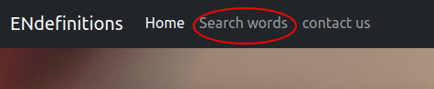

# ENdefinitions
Endefinitions é um site que permite a pesquisa de definições de palavras da língua inglesa(somente disponível definições em inglês). 

## Tecnologias utilizadas
Junto ao padrão de html, css e javascript o site usa a biblioteca [bootstrap](https://getbootstrap.com/), as API's [words api](https://www.wordsapi.com/).

### Estilização
A maioria dos componentes vieram do bootstrap, porém foram adicionados alguns componentes, e diversas classes personalizadas para suprir necessidades mais especificas do projeto.

### Pesquisa das palavras

Para a pesquisa e o retorno de definições e sugestões, ENdefinitios se integra com a WordsApi, da qual é usada o funcionalidade "definitions" para retornar uma definição para a palavra, caso a api contenho uma definição, e a funcionalidade de palavras aleatórias dela que é usado na criação de sugestões de pesquisa, que tras uma palavra aleatoria ja preenchida no input de pesquisa toda vez que a pagina é recarregada.

## Como usar

Para utilizar a funcionalidade de pesquisa é necessario ir a aba search, que pode ser acessada no menu de navegação,  

apertando o icone de lupa na pagina principal  

e tambem no rodapé da pagina  

## Página de contato

