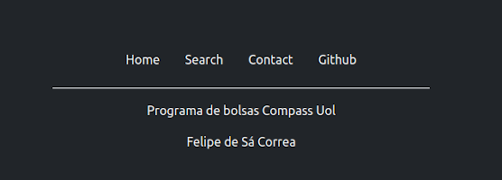
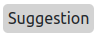
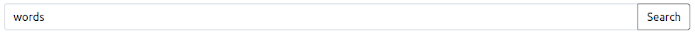

# ENdefinitions
Endefinitions é um site que permite a pesquisa de definições de palavras da língua inglesa(somente disponível definições em inglês). 

## Conteúdo
* [Bibliotecas e APIs](#Bibliotecas-e-APIs)
* [Estilização](#Estilização)
* [Interatividade e APIs](#Interatividade-e-APIs)
* [Como usar](#Como-usar)
  - [Pesquisa das palavras](#Pesquisa-das-palavras)
  - [Página de contato](#Página-de-contato)

## Bibliotecas e APIs
Para o projeto foram utilizadas as bibliotecas e APIs a seguir:
* [bootstrap](https://getbootstrap.com/)
* [words api](https://www.wordsapi.com/)
* [prog-bolsas-api](https://github.com/leostacowski/prog-bolsas-api)

## Estilização
A maioria dos componentes vieram do bootstrap, porém uma certa quantia de css personalizado foi adicionado as páginas, e alguns poucos componetes foram criandos do zero.

#### Exemplos:
  
*Uma navegaçõa pronta pega do bootstrap.*


  
*Um footer pego da area de exemplos do bootstrap porém contendo modificações para se adequar melhor a página.*


  
*Um componete feito do zero(Uma tag span com um pouco de css aplicado).*

## 


## Interatividade e APIs
Parte da interatividade do site já veio embutida com o bootstrap, carrousel e navegação responsiva, o resto como a pesquisa das definições e envio de formulários foram feitos com a interação de javascript e APIs.

As requisições de ambas as APIs foram feitas utilizando a função [**fetch**](https://developer.mozilla.org/en-US/docs/Web/API/Fetch_API/Using_Fetch) do javascript.
```
  fetch("https://wordsapiv1.p.rapidapi.com/words/?random=true", {
      method: "GET",
      headers: {
          "x-rapidapi-host": "wordsapiv1.p.rapidapi.com",
          "x-rapidapi-key": "bec3f1a7a8mshb9d8e1147d7b805p1d21d4jsn9f2f8cfd64c3"
      }
  })
  .then(response => response.json()) 
  .then(data => placeSuggestion(data, input))
  .catch(err => console.log("error: ", err))
```  
*exemplo de funcão fetch retirada do arquivo ./js/search/loadSuggestions.js*

## Como usar
### Pesquisa das palavras
Para utilizar a funcionalidade de pesquisa é necessario ir a aba search, que pode ser acessada no menu de navegação,  


Na pagina haverá um  input de pequisa onde deverá ser escrita a palavra que se deseja saber a definição.


#### Sugestões
Pode-se perceber que quando a página carregar provavelmente o input pode já estar preenchido com um palavra, essa é a funcionalidade de sugestões, ela tras uma palavra aleatória da [api](https://www.wordsapi.com/) preenche o input caso ele esteja vazio durante o carregamento da página. Caso não deseje pesquisar palavra sujerida só é necessaria apaga-la e pesquisar o que tenha em mente.

#### Palavras sem difinição
A words api conta com uma quantidade absurda de palavras, porém se limita com palavras do inglês e mesmo com essas é possivel se deparar com uma palavra desconhecida a api, nesses casos sua pesquisa será respondida com a mensagem "word not found".

Porém ainda existe um segundo caso, nem todas as palavras disponiveis contam com uma definição, nesses caso a pesquisa retornara a palavra pesquisada seguinda da mensagem "No definition found / Nenhuma definição encontrada"

### Página de contato
A página de contato tem um funcionalidade mais simples, o formulário deve ser prenchido e enviado, as informações contidas nele serão mandadas para a [api de boldas da compasso](https://github.com/leostacowski/prog-bolsas-api).

